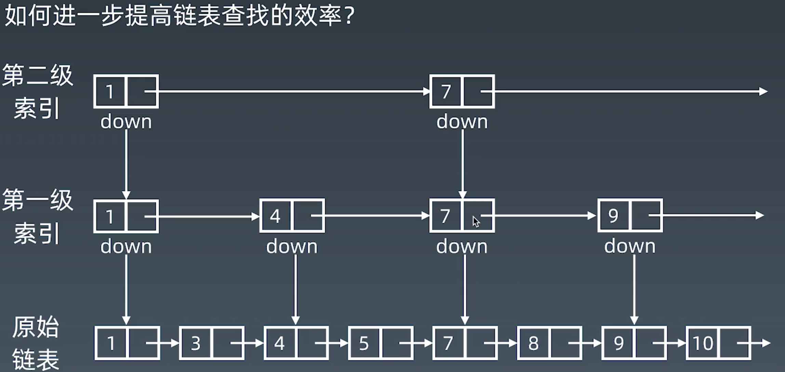
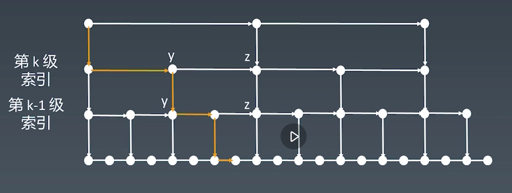

### 数组
- 数组是在内存中开辟一段连续的空间，在js中实现数组如下（针对于数据结构基础用法总结）
- 在插入一个数据时，比如在ABCEF中，在CE中插入D，就得将EF往后挪位，然后将D赋值进去，删除同理，所以插入和删除的时间复杂度为O(n/2)

声明方式
```
var arr = [1, 3, 5, 6];
var arr1 = new Array(1, 2, 3, 4);
```
获取长度
```
console.log(arr.length);
// 如果改变length，则数组会被切断
arr.length = 2; // [1, 3];
```
数组基础方法（会改变原数组）
```
var arr = [1, 3, 5, 6];
var lenth = arr.push(10); // 后面插入元素,返回值是数组长度
var lenth = arr.unshift(10); // 前面插入元素,返回值是数组长度
var pop = arr.pop(); // 拿数组最后一个元素，返回最后一个元素
var shift = arr.shift(); // 拿数组的头元素,返回头元素
var splice = arr.splice(1, 1); // 删除第1个元素开始的一位,返回截取数组
var splice = arr.splice(1, 0, 10); // 替换元素，返回空数组
var splice = arr.splice(1, 1, 10); // 替换元素,返回截取的元素
```
不改变原数组的截取方法
```
var arr = [1, 3, 5, 6];
var slice = a.slice(0, 1); // 截取数组元素
var copy = arr.slice(); // 拷贝元素，浅拷贝
```
查找元素
```
var arr = [1, 3, 5, 6];
var index = arr.indexOf(5); // 能够查找到就返回下标，不能就返回-1
```

方法的数组的时间复杂度

| 数组操作 | 时间复杂度 |
| -------- | ---------- |
| prepend  | O(1)       |
| append   | O(1)       |
| lookup   | O(1)       |
| insert   | O(n)       |
| delete   | O(n)       |

##### 数组题解—leetcode-283

**给定一个数组 `nums`，编写一个函数将所有 `0` 移动到数组的末尾，同时保持非零元素的相对顺序。**

**示例:**

```
输入: [0,1,0,3,12]
输出: [1,3,12,0,0]
```

**说明**:

1. 必须在原数组上操作，不能拷贝额外的数组。
2. 尽量减少操作次数。

```
// 暴力破解，遍历一次，把0设为null，再遍历第二次，删除null元素
// 可以另外一种思路，用一个栈记录0的位置，然后第二次循环，从栈中取出数据依次删除
// 时间复杂度计算，两次遍历，O(2n)的复杂度，真实计算可能还得往上，因为用splice移动元素也是O(n)的复杂度
var moveZeroes = function(nums) {
    const len = nums.length;
    for (let i = 0; i < len; i++) {
        if (nums[i] === 0) {
            nums[i] = null;
            nums.push(0);
        }
    }
    let j = 0;
    while(j < len) {
        if (nums[j] === null) {
            nums.splice(j, 1);
        } else {
            j++;
        }
    }
    return nums;
};
```

| i    | j    |      |      |      |      |      |
| ---- | ---- | ---- | ---- | ---- | ---- | ---- |
| 0    | 0    | 0    | 1    | 0    | 3    | 12   |
| 1    | 1    | 1    | 0    | 0    | 3    | 12   |
| 2    | 1    | 1    | 0    | 0    | 3    | 12   |
| 3    | 2    | 1    | 3    | 0    | 0    | 12   |
| 4    | 3    | 1    | 3    | 12   | 0    | 0    |

```
// 双指针解法，循环一层指针i，并用一个变量j记录0的位置，在i对应的值为0的时候，不移动j，当i对应的值为非0时，判断j记录的值时0的话，交换两元素
// 时间复杂度计算,一层循环O(n)
var moveZeroes = function(nums) {
    let j = 0;
    for (let i = 0; i < nums.length; i++) {
        if (nums[i] !== 0) {
            if (nums[j] === 0) {
                nums[j] = nums[i];
                nums[i] = 0;
            } 
            j++;
        }
    }
    return nums;
}
```

##### 数组题解—leetcode-11

给你 n 个非负整数 a1，a2，...，an，每个数代表坐标中的一个点 (i, ai) 。在坐标内画 n 条垂直线，垂直线 i 的两个端点分别为 (i, ai) 和 (i, 0)。找出其中的两条线，使得它们与 x 轴共同构成的容器可以容纳最多的水。

说明：你不能倾斜容器，且 n 的值至少为 2。


图中垂直线代表输入数组 [1,8,6,2,5,4,8,3,7]。在此情况下，容器能够容纳水（表示为蓝色部分）的最大值为 49。

**示例：**

```
输入：[1,8,6,2,5,4,8,3,7]
输出：49
```

```
// 暴力破解，时间复杂度是O(n^2)
var maxArea = function(height) {
    let max = 0;
    for (let i = 0 ; i < height.length - 1; i++) {
        for (let j = i + 1; j < height.length; j++) {
            max = Math.max(Math.min(height[i], height[j]) * (j - i), max);
        }
    }
    return max;
};
```

```
// 双指针夹逼法
// 思路，取下标最大的值，然后依次向里收缩，首先下标最大，高度小的向里移一步，重复循环步骤，
// 因为下表长度单位内最长，所以同样是要移动一步，那么单位内必然是小的向内移动可能会取得更大的值
// 时间复杂度是O(n)
var maxArea = function(height) {
    let max = 0;
    let j = height.length - 1;
    let i = 0;
    while (i < j) {
        max = Math.max(Math.min(height[i], height[j]) * (j - i), max);
        if (height[i] - height[j] < 0) {
            i++;
        } else {
            j--;
        }
    }
    return max;
};
```

##### 数组题解—leetcode-70

假设你正在爬楼梯。需要 n 阶你才能到达楼顶。

每次你可以爬 1 或 2 个台阶。你有多少种不同的方法可以爬到楼顶呢？

注意：给定 n 是一个正整数。

**示例 1：**

```
输入： 2
输出： 2
解释： 有两种方法可以爬到楼顶。
1.  1 阶 + 1 阶
2.  2 阶
```

**示例 2：**

```
输入： 3
输出： 3
解释： 有三种方法可以爬到楼顶。
1.  1 阶 + 1 阶 + 1 阶
2.  1 阶 + 2 阶
3.  2 阶 + 1 阶
```

| total | 走法                                                      |
| ----- | --------------------------------------------------------- |
| 1     | 1                                                         |
| 2     | 1+1、2                                                    |
| 3     | 1+1+1、2+1、1+2                                           |
| 4     | 1+1+1+1、2+1+1、1+2+1、2+2                                |
| 5     | 1+1+1+1+1、2+1+1+1、1+2+1+1、2+2+1、2+1+2、1+2+2、1+1+1+2 |

有以上可以推演出，第n级台阶就是由((n-1)+1)+((n-2)+2)种方法，那么f(n) = f(n-1) + f(n-2)

```
// 时间复杂度为o(n)
var climbStairs = function(n) {
		// 把小于2的值返回
    if (n <= 2) return n;
    // 当前n的前n-2的值，默认起始为索引1的值
    let prevSecond = 1;
    // 当前n的前n-1的值，默认起始为索引2的值
    let prevFirst = 2;
    let result = 0;
    // 从3开始计算
    for (let i = 3; i <= n; i++) {
        result = prevFirst + prevSecond;
        prevSecond = prevFirst;
        prevFirst = result;
    }
    return result;
};
// 也可以用斐波那契公式等方法，TODO
```

##### 数组题解—leetcode-15

给你一个包含 n 个整数的数组 nums，判断 nums 中是否存在三个元素 a，b，c ，使得 a + b + c = 0 ？请你找出所有满足条件且不重复的三元组。

注意：答案中不可以包含重复的三元组。

**示例：**

```
给定数组 nums = [-1, 0, 1, 2, -1, -4]，

满足要求的三元组集合为：
[
  [-1, 0, 1],
  [-1, -1, 2]
]
```

```
// 暴力解法，时间复杂度O(n^3)，数据多的时候，会超时
var threeSum = function(nums) {
    const result = [];
    const set = new Set();
    for (let i = 0; i < nums.length - 2; i++) {
        for (let j = i+1; j < nums.length - 1; j++) {
            for (let k = j + 1; k < nums.length; k++) {
                if ((nums[i] + nums[j] + nums[k]) === 0) {
                    const tempResult = [nums[i], nums[j], nums[k]];
                    const key = tempResult.sort().join(",");
                    if (!set.has(key)) {
                        result.push(tempResult);
                        set.add(key);
                    }
                }
            }
        }
    }
    return result;
};
```


### 链表

- 删除插入操作比较频繁，元素定义好后，有value和next结构类似{ value: 5, next: { value: 10, next: { value: 7, next: null } } }

- 如果链表中，只有指向下一项，那么就叫单链表，如果还有prev，就是双链表，如果最有一项指向第一项，就是循环链表

- 链表中插入元素，只需要将上一个的next指向要插入的元素，然后将当前节点的next指向下一个元素（O(1)）

- 随机访问元素，时间复杂度较高O(n)，而插入删除都是O(1)

| 操作    | 时间复杂度 |
| ------- | ---------- |
| prepend | O(1)       |
| append  | O(1)       |
| lookup  | O(n)       |
| insert  | O(1)       |
| delete  | O(1)       |

##### js实现链表
```
class Node{ // 代表的是链表中的某一个节点
    constructor(element){
        this.element = element;
        this.next = null;
    }
}
class LinkList {
    constructor(){
        this.head = null;
        this.length = 0;
    }
    insert(position,element){
        let node = new Node(element);
        if(!this.head){
            this.head = node;
        }else{
            let index = 0;
            let current = this.head;
            let previous = null;
            while(index++ < position){ // 找到要在谁之前插入那一项
                previous = current; // 那到要插入到哪项之前
                current = current.next; // 插入到前一个后面
            }
            previous.next = node;
            node.next = current
        }
        this.length++;
    }
    append(element){
        let node = new Node(element);
        if(!this.head){
            this.head = node;
        }else{
            let index = 0; // 从0向开始查找
            let current = this.head; // 先把链表的头拿出来 开始查找
            while(++index < this.length){
                current = current.next; // 如果当前不是最后一项就把这个人的下一项继续查找
            }
            current.next = node;
        }
        this.length++;
    }
}
```

### 跳表

- 跳表的使用，只能用于元素有序的情况

- 跳表对标的是一种平衡树（AVL Tree）和二分查找，是一种插入/删除/搜索都是O(log n)的数据结构，

- 优势是原理简单，实现容易，方便扩展，效率更高，一些热门项目用来替换平衡树，如Redis、LevelDB

- 一维的数据结构要加速，就得升级为二维数据结构

**索引的高度是： lognn，每层索引遍历的节点个数是3**

**在跳表中查询任意数据的时间复杂度就是O(log n)**





### **栈**

- 先进后出的容器结构，添加删除操作O(1)，查询是o(n)

##### js实现栈
```
class Stack{
    constructor(){
        this.stack = [];
    }
    put(element){
        this.stack.push(element);
    }
    pop(){
        this.stack.pop();
    }
}
```


### **队列**

- 先进先出，添加删除操作O(1)，查询是o(n)

##### js实现队列
```
class Queue{
    constructor(){
        this.queue = [];
    }
    enqueue(element){
        this.queue.push(element);
    }
    dequeue(){
        this.queue.shift();
    }
}
let queue = new Queue();
```


### 双端队列（Double-End Queue）

- 可以在起始位置和结束位置都插入和删除元素，添加删除操作O(1)，查询是o(n)


### 优先队列 priority-queue

- 插入O(1)，取出o(logN)-按优先级取出，底层具体实现的数据结构较为多样和复杂，可以用heap、bst、treap